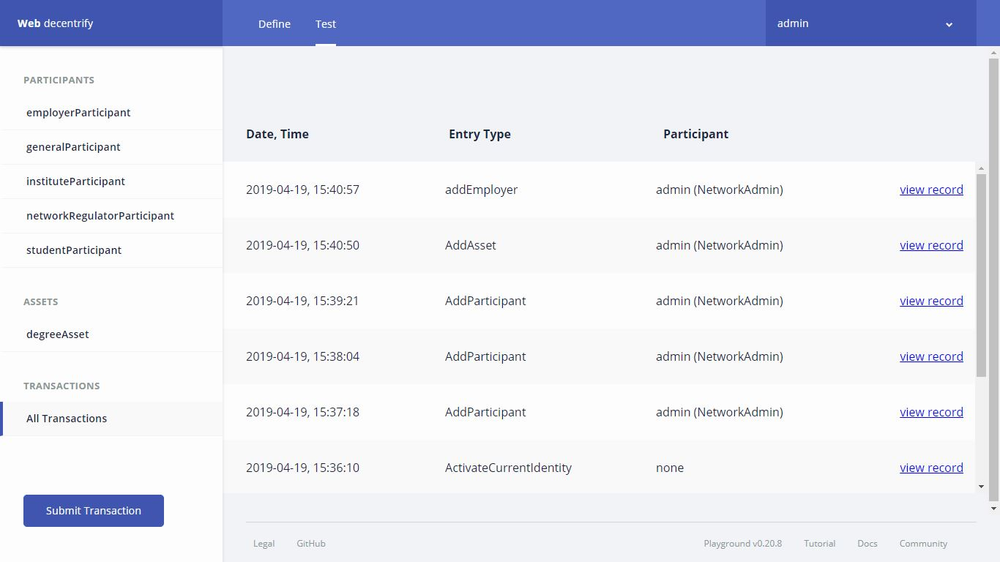
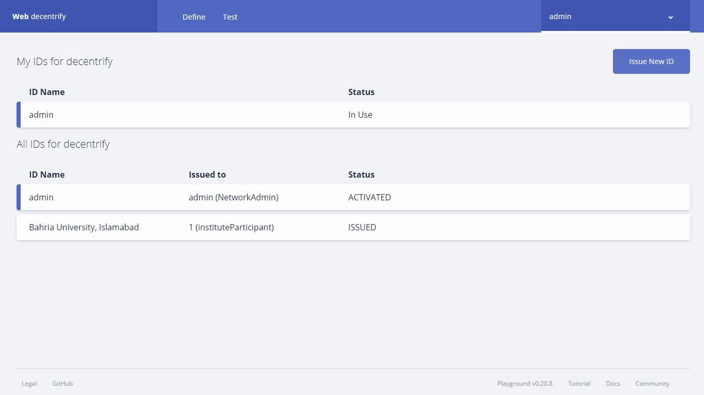
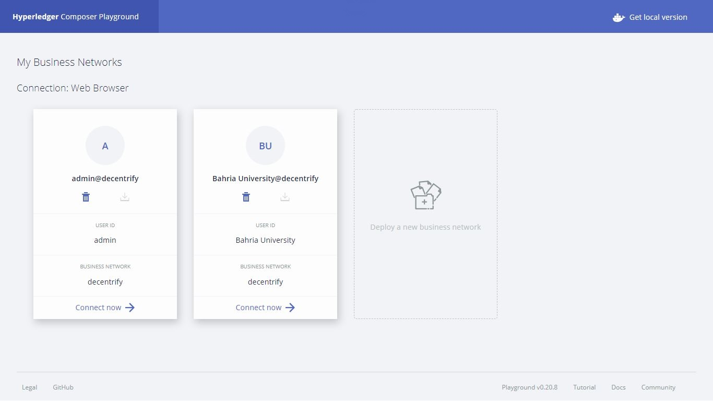
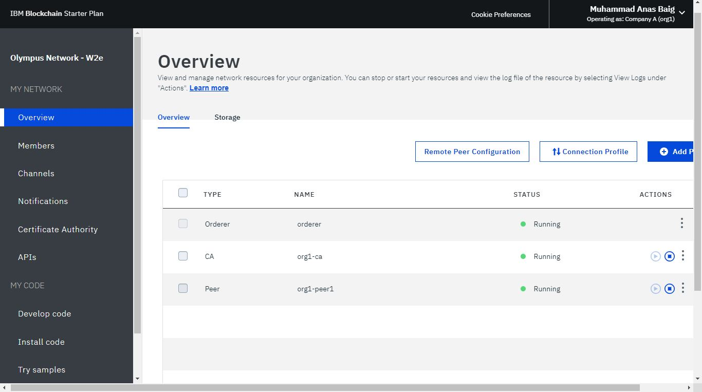
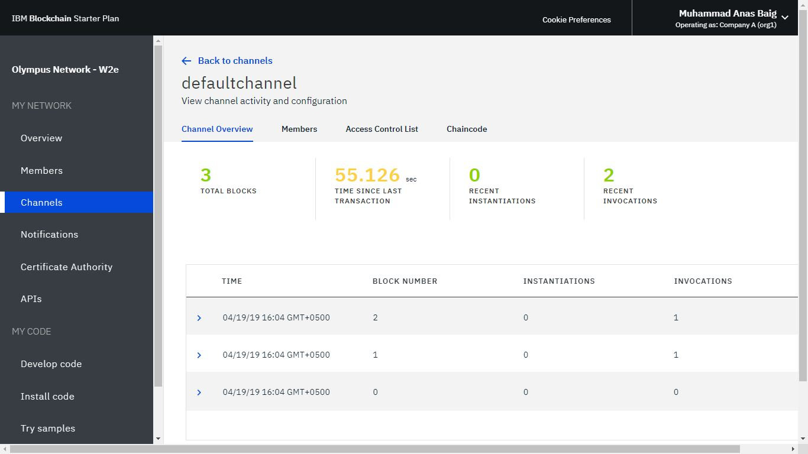

# decentrify

[Project SRS Document](https://1drv.ms/b/s!AuX6hGa70b74gbQP-MjpD16GzQBjBw?e=Aq2Na1)

decentrify - a decentralized degree verification system: 
Online degree/certificate verification system on private blockchain Hyperledger Fabric by IBM, which provides real-time verification solution with high integrity, immutability and transparency of Distributed Ledger Technology (DLT).

<kbd></kbd>

<kbd></kbd>

<kbd></kbd>

<kbd></kbd>

<kbd></kbd>

